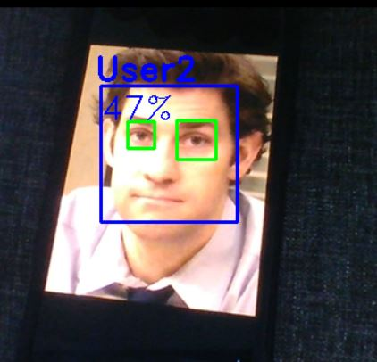

# Facial Recognition

Facial recognition using OpenCV, Python (ver --3.7.1), PIL, numpy and HaarCascades for face and eye recognition.

Learning ML and its basic concepts, via face recognition.

#### requirements.txt
- Contains all the required libraries necessary for to run the code. These libraries are:
    1. opencv-python==4.0.0.21
    2. numpy==1.16.2
    3. Pillow==5.4.1

#### run_script.bat
- A batch file for checking requirements and to run the python file ```trial_run.py```

#### trial_run.py
- To run this file and check if everything is installed and is running run the following command 

    ```python .\trial_run.py```

#### dataset_generation.py
- Creates a dataset of face(s) so it can be used for training purposes. This will create a folder called dataset and will output the faces captured in the frame into the folder. To generate the dataset the following command should be used:

    ```python .\dataset_generation```

#### dataset_training.py
- Uses the x, y, w, and h coordinates of the faces from the dataset and their labels with the cooresponding face. Uses the Local binary pattern history facerecognizer to train and al the data gets writtern to trainer folder with the necessary histogram data needed for recognition. To train the dataset the following command should be used:

    ```python .\dataset_training.py```

#### face_recognition.py
- Uses the LBPH face recognizer class and the training data using the LBPH and HaarCascade histograms. All of the name ids for each time a new face is trained here should be added each time to the nameID array. The confidence of the prediction is set to > 45% as there are only consists of 1000 images per face currently, this can be increased but due to the limited computational complexity and power it was set to 1000 images.

    ```python .\face_recognition.py```

## Example of the face and eye recognize

*Sample output of the face recognition*
